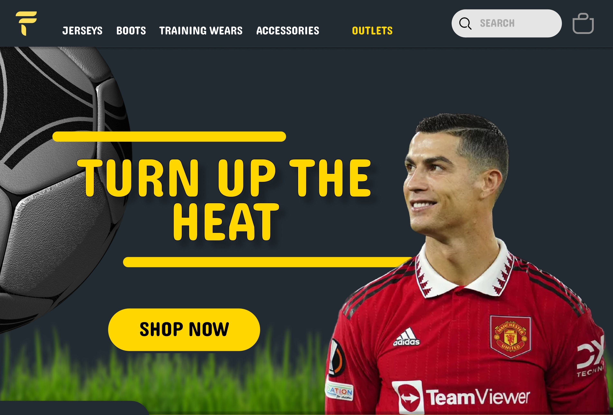
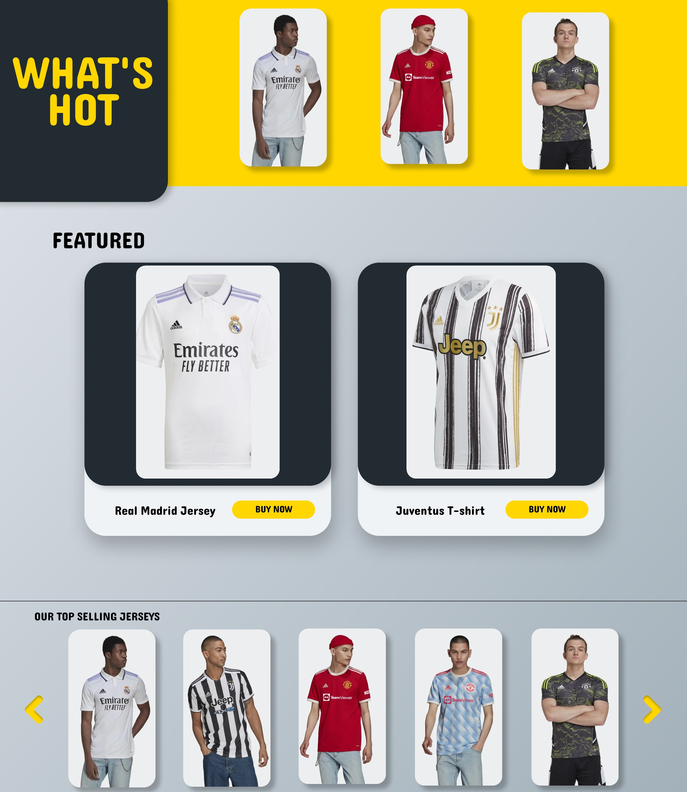
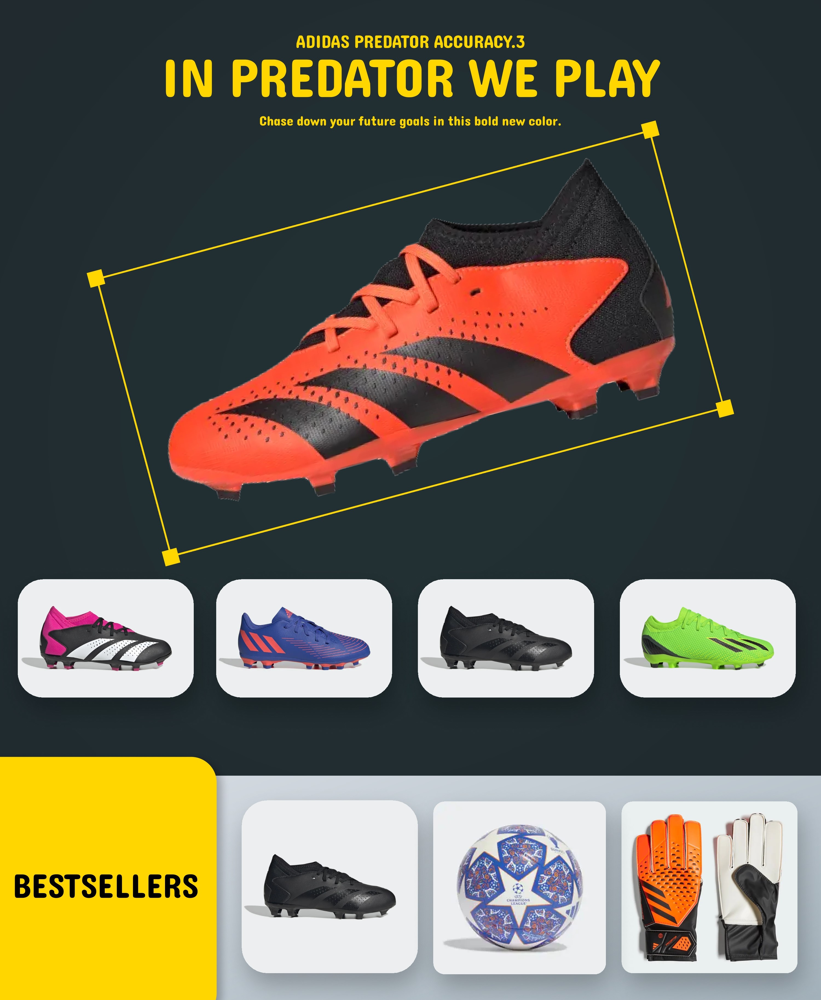
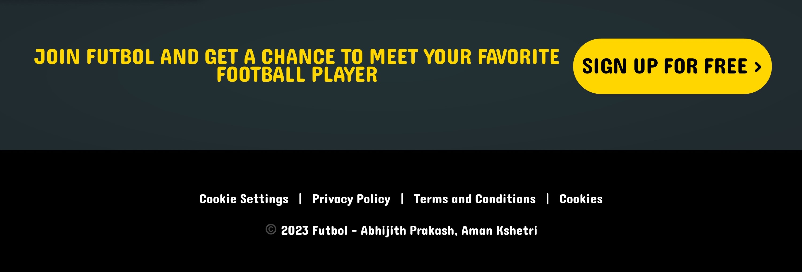

# Futbol UI - An all in one football related store ⚽
> Futbol UI is an all-in-one football-related store that sells football jerseys, boots, training wears, and other accessories. The landing page showcases our wide range of products, their features, and benefits. It provides a seamless shopping experience that allows users to browse, search and purchase their favorite football gear easily.
> Live demo [_here_](https://www.figma.com/file/5xxyS8WMesfHP4hm2wkJCH/UI-timate?type=design&node-id=0%3A1&t=GJRVFDnRkjuH9bvU-1). <!-- Project Link -->

## Table of Contents
* [Inspiration💡](#inspiration)
* [What it does⚙️](#what_it_does)
* [How we built it🛠️](#built)
* [Challenges we ran into 😓](#challenges)
* [Accomplishments that we're proud of 🏅](#accomplishments)
* [What we learned 🎓](#learning)
* [What's next for Futbol UI 🔜](#what-next)
* [Screenshots 🖼️](#screenshots)
* [Contact 📩](#contact)
<!-- * [License](#license) -->

## Inspiration 💡
As football enthusiasts, we wanted to create a platform that provides everything football-related in one place. The inspiration behind Futbol UI was to create a seamless shopping experience for football fans who want to buy authentic and high-quality football gear.

## What it does ⚙️
Futbol UI is an all-in-one football-related store that sells football jerseys, boots, training wears, and other accessories. The landing page showcases our wide range of products, their features, and benefits. It provides a seamless shopping experience that allows users to browse, search and purchase their favorite football gear easily.

## How we built it 🛠️
- We used Figma and Photoshop to design the landing page. 
- We started with wireframes and prototypes to establish the layout and functionality of the page. After several iterations, we finalized the design and developed the page using Figma and Photoshop.

## Challenges we ran into 😓
One of the biggest challenges we faced was organizing the products in a way that is easy to navigate and search. We wanted to provide users with a seamless shopping experience that allows them to find the products they are looking for quickly and easily. After several iterations and user testing, we were able to create a layout that is intuitive and user-friendly.

## Accomplishments that we're proud of 🏅
We are proud of the visual appeal and functionality of the landing page. We were able to create a design that captures the essence of football while providing users with a seamless shopping experience. We also take pride in the high-quality products we offer and the positive feedback we have received from our customers.

## What we learned 🎓
During the project, we learned a lot about the importance of user experience and the role of visual elements in guiding visitors toward the desired action. We also learned about the challenges involved in creating a seamless shopping experience, such as organizing products and optimizing search functionality.

## What's next for Futbol UI 🔜
Our next steps involve expanding this Figma design into a code-based full-stack project and deploying it for the user.

## Screenshots 🖼️

## Contact 📩
Created by: [@abhijithprakash](https://www.linkedin.com/in/abhijithprakash2003/) and [@amankshetri](https://www.linkedin.com/in/amankshetri/) - feel free to contact us! 🙂
